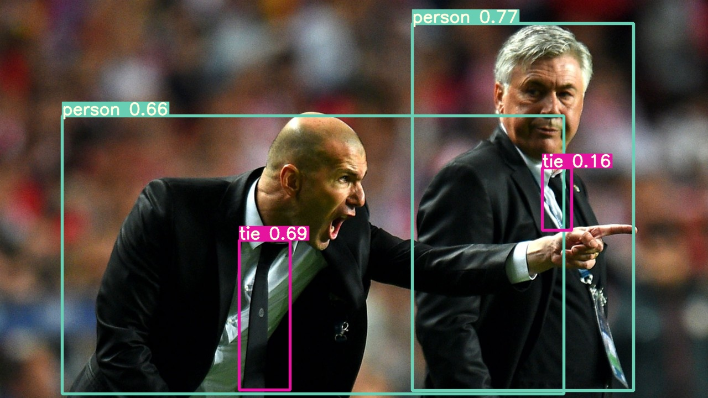
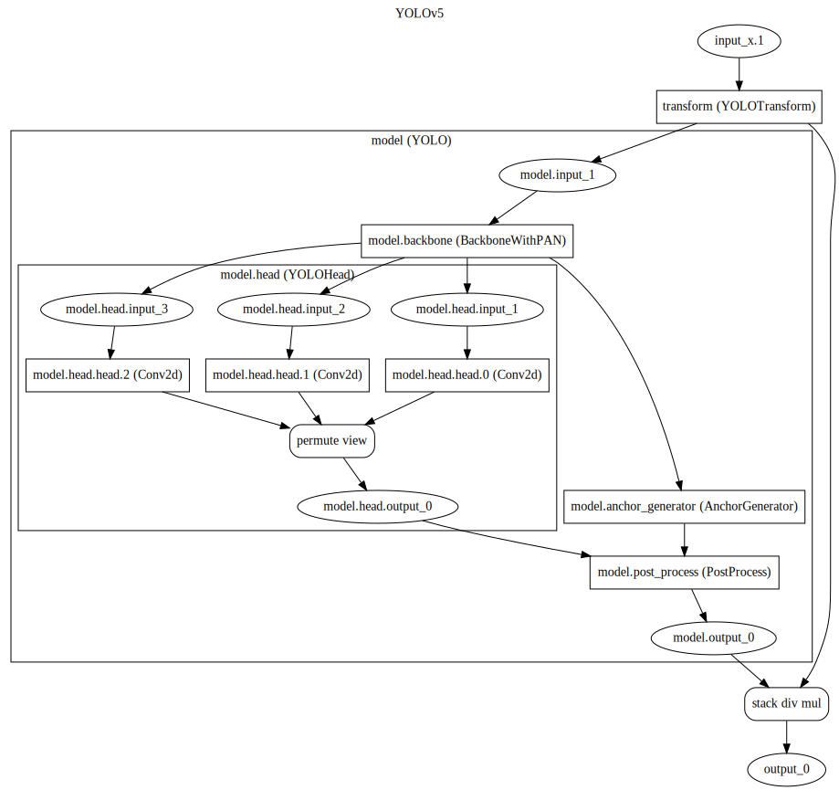

<div align="center">


**YOLOv5 Runtime Stack**

______________________________________________________________________

[Documentation](https://zhiqwang.com/yolov5-rt-stack/) •
[Installation Instructions](https://zhiqwang.com/yolov5-rt-stack/installation.html) •
[Deployment](#-deployment) •
[Contributing](.github/CONTRIBUTING.md) •
[Reporting Issues](https://github.com/zhiqwang/yolov5-rt-stack/issues/new?assignees=&labels=&template=bug-report.yml)

______________________________________________________________________

[](https://github.com/zhiqwang/yolov5-rt-stack/issues?q=is%3Aopen+is%3Aissue+label%3A%22help+wanted%22)
[](https://github.com/zhiqwang/yolov5-rt-stack/releases)
[](https://pepy.tech/project/yolort)
[](https://join.slack.com/t/yolort/shared_invite/zt-mqwc7235-940aAh8IaKYeWclrJx10SA)
[](https://badge.fury.io/py/yolort)
[](https://pypi.org/project/yolort/)

[](https://github.com/zhiqwang/yolov5-rt-stack/actions/workflows/ci-test.yml)
[](https://github.com/zhiqwang/yolov5-rt-stack/tree/gh-pages)
[](https://results.pre-commit.ci/latest/github/zhiqwang/yolov5-rt-stack/main)
[](https://codecov.io/gh/zhiqwang/yolov5-rt-stack)

______________________________________________________________________

</div>

## 🤗 Introduction

**What it is.** Yet another implementation of Ultralytics's [YOLOv5](https://github.com/ultralytics/yolov5). yolort aims to make the training and inference of the object detection task integrate more seamlessly together. yolort now adopts the same model structure as the official YOLOv5. The significant difference is that we adopt the dynamic shape mechanism, and within this, we can embed both pre-processing (letterbox) and post-processing (nms) into the model graph, which simplifies the deployment strategy. In this sense, yolort makes it possible to deploy the object detection more easily and friendly on `LibTorch`, `ONNX Runtime`, `TVM`, `TensorRT` and so on.

**About the code.** Follow the design principle of [detr](https://github.com/facebookresearch/detr):

> object detection should not be more difficult than classification, and should not require complex libraries for training and inference.

`yolort` is very simple to implement and experiment with. Do you like the implementation of torchvision's faster-rcnn, retinanet or detr? Do you like yolov5? You'll love `yolort`!

<a href="notebooks/assets/zidane.jpg"></a>

## 🆕 What's New

- *Dec. 27, 2021*. Add `TensorRT` C++ interface example. Thanks to [Shiquan](https://github.com/ShiquanYu).
- *Dec. 25, 2021*. Support exporting to `TensorRT`, and inferencing with `TensorRT` Python interface.
- *Sep. 24, 2021*. Add `ONNX Runtime` C++ interface example. Thanks to [Fidan](https://github.com/itsnine).
- *Feb. 5, 2021*. Add `TVM` compile and inference notebooks.
- *Nov. 21, 2020*. Add graph visualization tools.
- *Nov. 17, 2020*. Support exporting to `ONNX`, and inferencing with `ONNX Runtime` Python interface.
- *Nov. 16, 2020*. Refactor YOLO modules and support *dynamic shape/batch* inference.
- *Nov. 4, 2020*. Add `LibTorch` C++ inference example.
- *Oct. 8, 2020*. Support exporting to `TorchScript` model.

## 🛠️ Usage

There are no extra compiled components in `yolort` and package dependencies are minimal, so the code is very simple to use.

### Installation and Inference Examples

- Above all, follow the [official instructions](https://pytorch.org/get-started/locally/) to install PyTorch 1.8.0+ and torchvision 0.9.0+

- Installation via pip

  Simple installation from [PyPI](https://pypi.org/project/yolort/)

  ```shell
  pip install -U yolort
  ```

  Or from Source

  ```shell
  # clone yolort repository locally
  git clone https://github.com/zhiqwang/yolov5-rt-stack.git
  cd yolov5-rt-stack
  # install in editable mode
  pip install -e .
  ```

- Install pycocotools (for evaluation on COCO):

  ```shell
  pip install -U 'git+https://github.com/ppwwyyxx/cocoapi.git#subdirectory=PythonAPI'
  ```

- To read a source of image(s) and detect its objects 🔥

  ```python
  from yolort.models import yolov5s

  # Load model
  model = yolov5s(pretrained=True, score_thresh=0.45)
  model.eval()

  # Perform inference on an image file
  predictions = model.predict("bus.jpg")
  # Perform inference on a list of image files
  predictions = model.predict(["bus.jpg", "zidane.jpg"])
  ```

### Loading via `torch.hub`

The models are also available via torch hub, to load `yolov5s` with pretrained weights simply do:

```python
model = torch.hub.load("zhiqwang/yolov5-rt-stack:main", "yolov5s", pretrained=True)
```

### Loading checkpoint from official yolov5

The following is the interface for loading the checkpoint weights trained with `ultralytics/yolov5`. Please see our documents on what we [share](https://zhiqwang.com/yolov5-rt-stack/notebooks/how-to-align-with-ultralytics-yolov5.html) and how we [differ](https://zhiqwang.com/yolov5-rt-stack/notebooks/comparison-between-yolort-vs-yolov5.html) from yolov5 for more details.

```python
from yolort.models import YOLOv5

# Download checkpoint from https://github.com/ultralytics/yolov5/releases/download/v6.0/yolov5s.pt
ckpt_path_from_ultralytics = "yolov5s.pt"
model = YOLOv5.load_from_yolov5(ckpt_path_from_ultralytics, score_thresh=0.25)

model.eval()
img_path = "test/assets/bus.jpg"
predictions = model.predict(img_path)
```

## 🚀 Deployment

### Inference on LibTorch backend

We provide a [tutorial](https://zhiqwang.com/yolov5-rt-stack/notebooks/inference-pytorch-export-libtorch.html) to demonstrate how the model is converted into `torchscript`. And we provide a [C++ example](deployment/libtorch) of how to do inference with the serialized `torchscript` model.

### Inference on ONNX Runtime backend

We provide a pipeline for deploying yolort with ONNX Runtime.

```python
from yolort.runtime import PredictorORT

# Load the serialized ONNX model
engine_path = "yolov5n6.onnx"
y_runtime = PredictorORT(engine_path, device="cpu")

# Perform inference on an image file
predictions = y_runtime.predict("bus.jpg")
```

Please check out this [tutorial](https://zhiqwang.com/yolov5-rt-stack/notebooks/export-onnx-inference-onnxruntime.html) to use yolort's ONNX model conversion and ONNX Runtime inferencing. And you can use the [example](deployment/onnxruntime) for ONNX Runtime C++ interface.

### Inference on TensorRT backend

The pipeline for TensorRT deployment is also very easy to use.

```python
import torch
from yolort.runtime import PredictorTRT

# Load the serialized TensorRT engine
engine_path = "yolov5n6.engine"
device = torch.device("cuda")
y_runtime = PredictorTRT(engine_path, device=device)

# Perform inference on an image file
predictions = y_runtime.predict("bus.jpg")
```

Besides, we provide a [tutorial](https://zhiqwang.com/yolov5-rt-stack/notebooks/onnx-graphsurgeon-inference-tensorrt.html) detailing yolort's model conversion to TensorRT and the use of the Python interface. Please check this [example](deployment/tensorrt) if you want to use the C++ interface.

## 🎨 Model Graph Visualization

Now, `yolort` can draw the model graph directly, checkout our [tutorial](https://zhiqwang.com/yolov5-rt-stack/notebooks/model-graph-visualization.html) to see how to use and visualize the model graph.

<a href="notebooks/assets/yolov5_graph_visualize.svg"></a>

## 👋 Contributing

We love your input! Please see our [Contributing Guide](.github/CONTRIBUTING.md) to get started and for how to help out. Thank you to all our contributors! If you like this project please consider ⭐ this repo, as it is the simplest way to support us.

[](https://github.com/zhiqwang/yolov5-rt-stack/graphs/contributors)

## 📖 Citing yolort

If you use yolort in your publication, please cite it by using the following BibTeX entry.

```bibtex
@Misc{yolort2021,
  author =       {Zhiqiang Wang and Shiquan Yu and Fidan Kharrasov},
  title =        {yolort: A runtime stack for object detection on specialized accelerators},
  howpublished = {\url{https://github.com/zhiqwang/yolov5-rt-stack}},
  year =         {2021}
}
```

## 🎓 Acknowledgement

- The implementation of `yolov5` borrow the code from [ultralytics](https://github.com/ultralytics/yolov5).
- This repo borrows the architecture design and part of the code from [torchvision](https://github.com/pytorch/vision).
