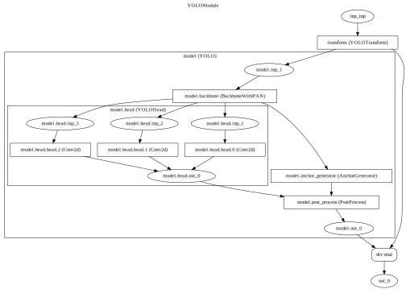

<div align="center">


**YOLOv5 Runtime Stack**

______________________________________________________________________

[Documentation](#%EF%B8%8F-usage) •
[Installation Instructions](#installation-and-inference-examples) •
[Deployment](#-deployment) •
[Contributing](#-contributing) •
[Reporting Issues](https://github.com/zhiqwang/yolov5-rt-stack/issues/new?assignees=&labels=&template=bug-report.yml)

______________________________________________________________________

[](https://pypi.org/project/yolort/)
[](https://badge.fury.io/py/yolort)
[](https://pepy.tech/project/yolort)
[](https://img.shields.io/github/downloads/zhiqwang/yolov5-rt-stack/total?color=blue&label=Downloads&logo=github&logoColor=lightgrey)

[](https://github.com/zhiqwang/yolov5-rt-stack/actions?query=workflow%3A%22CI+testing%22)
[](https://codecov.io/gh/zhiqwang/yolov5-rt-stack)
[](LICENSE)
[](https://join.slack.com/t/yolort/shared_invite/zt-mqwc7235-940aAh8IaKYeWclrJx10SA)

______________________________________________________________________

</div>

## 🤗 Introduction

**What it is.** Yet another implementation of Ultralytics's [YOLOv5](https://github.com/ultralytics/yolov5). `yolort` aims to make the training and inference of the object detection integrate more seamlessly together. `yolort` now adopts the same model structure as the official YOLOv5. The significant difference is that we adopt the dynamic shape mechanism, and within this, we can embed both pre-processing (`letterbox`) and post-processing (`nms`) into the model graph, which simplifies the deployment strategy. In this sense, `yolort` makes it possible to be deployed more friendly on `LibTorch`, `ONNXRuntime`, `TVM` and so on.

**About the code.** Follow the design principle of [detr](https://github.com/facebookresearch/detr):

> object detection should not be more difficult than classification, and should not require complex libraries for training and inference.

`yolort` is very simple to implement and experiment with. You like the implementation of torchvision's faster-rcnn, retinanet or detr? You like yolov5? You love `yolort`!

<a href=".github/zidane.jpg"></a>

## 🆕 What's New

- *Sep. 24, 2021*. Add `ONNXRuntime` C++ interface example. Thanks to [itsnine](https://github.com/itsnine).
- *Feb. 5, 2021*. Add `TVM` compile and inference notebooks.
- *Nov. 21, 2020*. Add graph visualization tools.
- *Nov. 17, 2020*. Support exporting to `ONNX`, and inferencing with `ONNXRuntime` Python interface.
- *Nov. 16, 2020*. Refactor YOLO modules and support *dynamic shape/batch* inference.
- *Nov. 4, 2020*. Add `LibTorch` C++ inference example.
- *Oct. 8, 2020*. Support exporting to `TorchScript` model.

## 🛠️ Usage

There are no extra compiled components in `yolort` and package dependencies are minimal, so the code is very simple to use.

### Installation and Inference Examples

- Above all, follow the [official instructions](https://pytorch.org/get-started/locally/) to install PyTorch 1.7.0+ and torchvision 0.8.1+

- Installation via Pip

  Simple installation from [PyPI](https://pypi.org/project/yolort/)

  ```shell
  pip install -U yolort
  ```

  Or from Source

  ```shell
  # clone yolort repository locally
  git clone https://github.com/zhiqwang/yolov5-rt-stack.git
  cd yolov5-rt-stack
  # install in editable mode
  pip install -e .
  ```

- Install pycocotools (for evaluation on COCO):

  ```shell
  pip install -U 'git+https://github.com/ppwwyyxx/cocoapi.git#subdirectory=PythonAPI'
  ```

- To read a source of image(s) and detect its objects 🔥

  ```python
  from yolort.models import yolov5s

  # Load model
  model = yolov5s(pretrained=True, score_thresh=0.45)
  model.eval()

  # Perform inference on an image file
  predictions = model.predict('bus.jpg')
  # Perform inference on a list of image files
  predictions = model.predict(['bus.jpg', 'zidane.jpg'])
  ```

### Loading via `torch.hub`

The models are also available via torch hub, to load `yolov5s` with pretrained weights simply do:

```python
model = torch.hub.load('zhiqwang/yolov5-rt-stack', 'yolov5s', pretrained=True)
```

### Loading checkpoint from official yolov5

The following is the interface for loading the checkpoint weights trained with `ultralytics/yolov5`. See our [how-to-align-with-ultralytics-yolov5](http://github.com/zhiqwang/yolov5-rt-stack/blob/master/notebooks/how-to-align-with-ultralytics-yolov5.ipynb) notebook for more details.

```python
from yolort.models import yolov5s

# 'yolov5s.pt' is downloaded from https://github.com/ultralytics/yolov5/releases/download/v5.0/yolov5s.pt
ckpt_path_from_ultralytics = 'yolov5s.pt'
model = yolov5s(score_thresh=0.25)
model.load_from_yolov5(ckpt_path_from_ultralytics)

model.eval()
img_path = 'test/assets/bus.jpg'
predictions = model.predict(img_path)
```

## 🚀 Deployment

### Inference on `LibTorch` backend

We provide a [notebook](notebooks/inference-pytorch-export-libtorch.ipynb) to demonstrate how the model is transformed into `torchscript`. And we provide an [C++ example](./deployment/libtorch) of how to infer with the transformed `torchscript` model. For details see the [GitHub Actions](.github/workflows/ci_test.yml).

### Inference on `ONNXRuntime` backend

## 🎨 Model Graph Visualization

Now, `yolort` can draw the model graph directly, checkout our [model-graph-visualization](notebooks/model-graph-visualization.ipynb) notebook to see how to use and visualize the model graph.

<a href="notebooks/assets/yolov5.detail.svg"></a>

## 🎓 Acknowledgement

- The implementation of `yolov5` borrow the code from [ultralytics](https://github.com/ultralytics/yolov5).
- This repo borrows the architecture design and part of the code from [torchvision](https://github.com/pytorch/vision).

## 🤗 Contributing

We appreciate all contributions. If you are planning to contribute back bug-fixes, please do so without any further discussion. If you plan to contribute new features, utility functions or extensions, please first open an issue and discuss the feature with us. *BTW, leave a 🌟 if you liked it, and this is the easiest way to support us* :)
