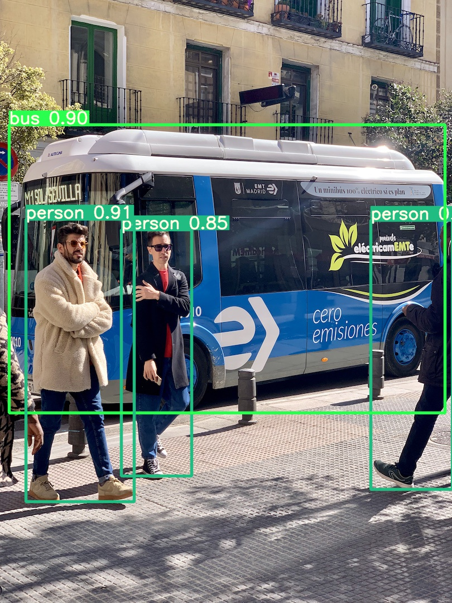

# 🔦 Yolov5 Runtime Stack

[](https://github.com/zhiqwang/yolov5-rt-stack/actions?query=workflow%3AStable) [](https://github.com/zhiqwang/yolov5-rt-stack/actions?query=workflow%3ANightly)

<p align="left"><a href=".github/bus_det.jpg"></a></p>

## 🆕 What's New and Development Plans

- [x] Support exporting to `TorchScript` model. *Oct. 8, 2020.*
- [x] Support doing inference using `LibTorch` cpp interface. *Oct. 10, 2020.*
- [ ] Support exporting to `onnx`, and doing inference using `onnxruntime`.
- [ ] Add more fetures ...

## 🛠 Usage

There are something different comparing to [ultralytics's](https://github.com/ultralytics/yolov5/blob/master/models/yolo.py) implementation, you should update [ultralytics's](https://github.com/ultralytics/yolov5/releases/download/v3.0/yolov5s.pt) trained (or your own) model checkpoint with the following command:

```bash
python -m utils.updated_checkpoint [--checkpoint-path ./yolov5s.pt]
                                   [--cfg-path ./models/yolov5s.yaml]
                                   [--updated-checkpoint-path ./checkpoints/yolov5/yolov5s.pt]
```

Or you can download it from [here](https://github.com/zhiqwang/yolov5-rt-stack/releases/download/v0.1.0/yolov5s.pt).

### PyTorch interface

The `detect.py` reads a directory and does inferencing with all contained images.

```bash
python -m detect [--model-cfg ./models/yolov5s.yaml]
                 [--input-source YOUR_IMAGE_SOURCE_DIR]
                 [--checkpoint ./checkpoints/yolov5/yolov5s.pt]
                 [--labelmap ./checkpoints/yolov5/coco.names]
                 [--output-dir ./data-bin/output]
                 [--img-size 416]
                 [--save-img]
                 [--gpu]  # GPU switch, Set False as default
```

### LibTorch interface

Here providing a minimal [example](test/tracing/test_tracing.cpp) of getting `LibTorch` inferencing to work. You can check the [CI](.github/workflows/stable.yml) for more details.

- Generate `TorchScript` model

Unlike [ultralytics's](https://github.com/ultralytics/yolov5/blob/master/models/export.py) trace (`torch.jit.trace`) mechanism, I use `torch.jit.script` to jit trace the YOLO models containing the whole post processing (especially the ops `nms`) procedures, so you don't need to rewrite manually the post processes.

```bash
python -m test.tracing.trace_model
```

- Setup the environment variables

```bash
export TORCH_PATH=$(dirname $(python -c "import torch; print(torch.__file__)"))
export LD_LIBRARY_PATH=$LD_LIBRARY_PATH:$TORCH_PATH/lib/
```

- Navigate to the root directory of the example

```bash
cd test/tracing
```

- Build the example

```bash
mkdir build && cd build
cmake .. -DTorch_DIR=$TORCH_PATH/share/cmake/Torch
make
```

## 🎓 Acknowledgement

- <https://github.com/ultralytics/yolov5>
- <https://github.com/yasenh/libtorch-yolov5>
